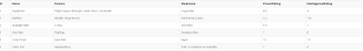

# SQL Select Statements

## Introduction

In SQL the SELECT statement is used to return a result from one or many tables within a given database. Within the database the SELECT statement is more commonly used as a data query command. This is where the query is used to retrieve information from zero or more columns, using one or many database tables.

In order to understand using SELECT statements properly the correct database management system must be installed. For this tutorial on the SELECT statement, sqlite version three must be properly installed. The best location for installing sqlite is:

[https://www.sqlite.org/download.html](https://www.sqlite.org/download.html)

Download and install the sqlite package that matches your operating system. The operating system in use will determine which sqlite package zip file to download and install. Once the zip file has been downloaded, the user must first extract the files from the folder by right clicking the zipped folder icon and selecting the extract all option. A window will pop up asking for the location to extract the files and this will be up to the user on where they would like to keep the file located. The location for the file will need to be added to the path for the installation process to be completed.

To add the files to the path the user must go to the control panel, locate the 'environment'. The user will then select edit the system and environment variables. A window will appear and the user will select environment variables. Under the system variables table, select the path variable, then locate and select edit. A new window will appear, this is where the user must click new. This is where the folder location of the sqlite files are located.

Let's make some selections from an example superhero database.

 

Problem: Select each unique power rating from the hero table.

 Solution: 

 SELECT DISTINCT PowerRating FROM Hero

Problem: Select all heros with a power rating of 1

 Solution: 

SELECT Name FROM Hero WHERE PowerRating = 1;

We could create more complex conditionals using AND, OR, NOT, IS NULL, LIKE, IN, and BETWEEN statements.

Problem: Select all heros in order of their respective power ratings

Solution: 

 SELECT * FROM Hero ORDER BY PowerRating;

Problem: select the top 3 heros from the table

Solution:

 SELECT TOP 3 * FROM Hero

Problem: Select the name of the hero with the greatest power rating

Solution:

SELECT Name FROM Hero WHERE PowerRating = (SELECT MAX(PowerRating) FROM Hero);

Problem: Select the number of heros in the database

Solution:

SELECT COUNT(*) FROM Hero

Problem: Select the average power of all heros

Solution:

SELECT AVG(PowerRating) FROM Hero

Problem: Select the sum of all hero power ratings [Reference](#select-sum)

Solution:

 SELECT SUM(PowerRating) FROM Hero

## Statement Types

### Select Distinct

When running queries against the database, a common issue can be that multiple identical rows are returned when only unique entries are desired to be returned from the query. This is issue is resolved in SQL with the SELECT DISTINCT statement, which returns only distinct values.

 General Format:   
`SELECT DISTINCT {Column} FROM {Table}`
   
  Example: 
  `SELECT DISTINCT Country FROM Customers`
   
  The above statement allows a query to be made to find all the unique countries that customers are from in easily viewable manner; manually scanning the results for unique entries when there could easily be thousands of results would be quite cumbersome.

### Select Statement Conditionals

When using SELECT statements it can often be useful to only grab certain rows from the tables being queried depending on some condition. SQL allows for this using the WHERE modifier on SELECT statements such that it only selects rows where a particular condition is true.

 General Format:   
 `SELECT {Column} FROM {Table} WHERE {Condition}`
  
 Example:   
 `SELECT * FROM Customers WHERE Country = "USA"`
  
 By running the above statement, customers from the country USA are returned.

In addition to checking if a property matches a particular value, SELECT statements have a variety of conditional operators which include: AND, OR, NOT, IS NULL, LIKE, IN, and BETWEEN.

### Select Statement Conditionals: AND

The AND operator in SQL allows logical statements to be modified such that in order for the statement to be evaluated as true, both conditions on either side of the AND operator must be true. This is important for being able to require 2 differents conditions.

 General Format:   
 `SELECT {Columns} FROM {Tables} WHERE {Condition1} AND {Condition2}`
  
 Example:   
 `SELECT * From Customers WHERE Country = "USA" AND Sales > 500`
  
 The AND operator allows the selection of customers from the USA with sales of at least 500 with that customer.

### Select Statement Conditionals: OR

The OR operator in SQL allows logical statements to be modified such that in order for the statement to be evaluated as true, one or both conditions on either side of the OR operator must be true.

 General Format:   
  `SELECT {Column} FROM {Table} WHERE {Condition1} OR {Condition2}`
   
  Example:    
   `SELECT * FROM Customers WHERE Country = "USA" OR Sales > 500`
 
   This will select all customers who are located in the USA or who have sales greater than 500.

### Select Statement Conditionals: NOT

The NOT operator in SQL functions as a logical negation.

 General Format:   
   `SELECT {Column} FROM {Table} WHERE {item1} NOT {item2}`
    
   Example:   
     `SELECT * FROM Customers WHERE Country NOT "USA"`
 
     The example above takes the entire set of customers were they are not from USA.

### Select Statement Conditionals: IS NULL

In SQL, the IS NULL operator is used to test for NULL values. This operators main use is to find the NULL values in a specified column. NULL can be thought of as nothing, empty, or a zero value in the dataset.

General Format:    
`SELECT {Columns} FROM {Table} WHERE {Column} IS NULL`

### Select Statement Conditionals: IN

Using the IN operator allows for the easy checking of whether a value is in a value set.

 General Format:   
  `SELECT {Columns} FROM {Tables} WHERE {Value} IN {Value Set}`
    
   Example:   
   `SELECT * FROM Customers Where Id IN`
   `(SELECT Id From VIPCustomers WHERE Country = "USA")`    
    
   The above select statement allows the easy selection of customers where they are a VIP customer from the USA. The VIPCustomers table might only track a small amount of information about the customer compared to the regular customers table, thus the benefit of grabbing these customers from the Customers table by referencing the VIPCustomers table.

### Select Statement Conditionals: LIKE

The LIKE operator is useful for searching through large rows. It can be utilized with [regular expressions](https://www.regular-expressions.info/tutorial.html) to search by pattern through a table.

 General Format:   
   `SELECT * FROM Customers WHERE {Column} LIKE {Regular Expression} `
     
    Example:   
    `SELECT * FROM Customers WHERE County LIKE 's%'`
     
    The above statement returns all customers whose countries start with an 's'.

### Select Statement Conditionals: BETWEEN

To find information within a specific range the BETWEEN operator is used. The values can be text, numbers, or dates

 General Format:   
 `SELECT {Columns} FROM {Tables} WHERE {Column} BETWEEN {Value1} AND {Value2}`
  
 Example:   
 `SELECT * FROM Customers WHERE Sales BETWEEN 500 AND 1000`
  
 The above example selects all customers where sales are between 500 and 1000.

### ORDER BY

ORDER BY is a keyword that is used to sort data in ascending to descending order. The ascending order is always the default sorting technique used by ORDER BY. when the descending order in needed the specifier of DESC must be implemented at the end of the query. However, the method to use ascending and then descending order is described by placing ASC or DEAC at the end of the query. Where ASC is the signifier for ascending order.

 General Format:   
  `SELECT {Columns} FROM {Table} ORDER BY {Column} {ASC|DEAC}`
   
  Example:   
    `SELECT * FROM Customers ORDER BY Sales DEAC`
     
    This will select all the customers, ordered by sales in descending order.

### SELECT TOP(number)

Often times it is desirable to only select the beginning of a list, which can be done in SQL with the SELECT TOP statement that returns up to the number passed.

 General Format:   
 `SELECT TOP {Number} FROM {Tables}`
 
 Example:   
 `SELECT TOP 10 FROM Customers ORDER BY Sales`
  
 Selecting the top 10 customers by sales is able to be done with the above statement.

### SELECT MIN(column)|MAX(column)

MIN() returns the smallest value in the selected column

 General Format:   
 `SELECT MIN({columnName}) FROM {tableName}`
   
  Example:   
    `SELECT MIN(Rating) FROM reviews`
     
    In the example for MIN, MIN is used to find the smallest rating in the review table.

MAX() returns the largest value in the selected column:

 General Format:   
 `SELECT MAX({columnName}) FROM {tableName}`
  
 Example:   
  `SELECT MAX(Rating) FROM reviews`
  
  In the example above MAX is used to find the largest rating in the review table.

### SELECT COUNT(column)

When looking at data it can often be helpful to know how many occurrences there are of something, which is completed through using the SELECT COUNT statement.

General Format:   
`SELECT COUNT({Columns}) FROM {Tables}`
 
Example:   
`SELECT COUNT(*) FROM Customers WHERE Country = "USA"`
 
This statement allows the number of customers from the USA to be returned.

### SELECT AVG

Using a numeric based column only, the average can be achieved using the syntax of AVG().

 General Format:   
 `SELECT AVG{Column} FROM {Tables}`
  
 Example:   
   `SELECT AVG Sales FROM Customers`
    
   This statement returns the average of sales across all customers.

### SELECT SUM

The SUM keyword allows the summation of the values in a column.

 General Format:   
 `SELECT SUM({Column}) FROM {Tables}`
  
 Example:   
 `SELECT SUM(Sales) FROM Customers WHERE Country = "USA"`
  
 This statement returns the total sales from all US Customers.

### SELECT Statement Aliasing

Sometimes a column or table in SQL need a temporary name change for accessing a database with an easier to use name. This can be performed through aliasing. Aliasing can be used to protect the real name of the database fields. The aliasing name is temporarily instated for the duration of the query. Aliasing is commonly used to make the names more readable as correlation names.

 General Format:   
   `SELECT {columnName} AS {aliasName} FROM {tableName}`
    
   Example:   
     `SELECT CustomerID AS ID, CustomerName FROM Customers WHERE ID = "100"`
      
     This statement selects the id and name of the customer with id 100 with the alias referencing the CustomerID column as simply ID in the WHERE clause.

### SELECT Statement INNER JOIN

In SQL  the INNER JOIN keywords selects data from different tables with matching values.

 General Format:   
 `SELECT {columnName} FROM {FirstTable} INNER JOIN {SecondTable} ON {FirstTable.columnName} = {SecondTable.columnName}`
 
 Example:   
 `SELECT * FROM Customers INNER JOIN VIPCustomers ON Customers.ID = VIPCustomers.ID`
 
 This statement returns all the records in the Customers table where a matching id was found in the VIPCustomers table.

### Group By

When working data it can at times be useful to group the results by a particular column.

 General Format:   
 `SELECT {Columns} FROM {Tables} GROUP BY {Column}`
  
 Example:   
 `SELECT SUM(Sales), Country FROM Customers GROUP BY Country`
  
 The above statement allows the total sales for each country's customers to be returned.

### HAVING

At times, conditionals on grouped data can be desirable, that is using conditional logic after using the GROUP BY keyword which can be accomplished using the HAVING keyword.

 General Format:   
 `SELECT {Columns} FROM {Tables} GROUP BY {Column} HAVING {Condition}`
  
 Example:   
 `SELECT Country FROM Customers GROUP BY Country HAVING SUM(Sales) > 1,000,000`
  
 The above statement allows the selection of countries where the total sales from customers in that country is over 1,000,000.

### Exists

Often times knowing whether a value exists in a value set can be quite useful and is accomplished with the EXISTS keyword.

 General Format:   
 `SELECT {Columns} FROM {Tables} WHERE EXISTS (SELECT {Columns} FROM {Tables} WHERE {Condition})`
  
 Example:   
 `SELECT demand FROM consumer`
 `WHERE EXISTS (SELECT item FROM sales WHERE stock= "empty")`
  
 The EXISTS example seen is using the data where the stock of an item marked under consumer demand is empty.